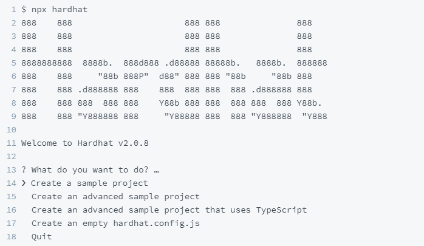
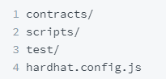
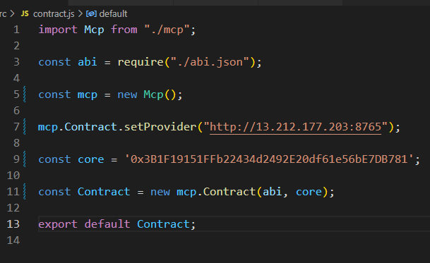
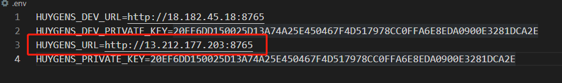
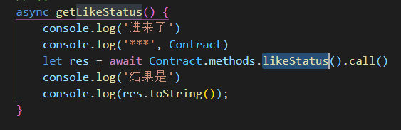
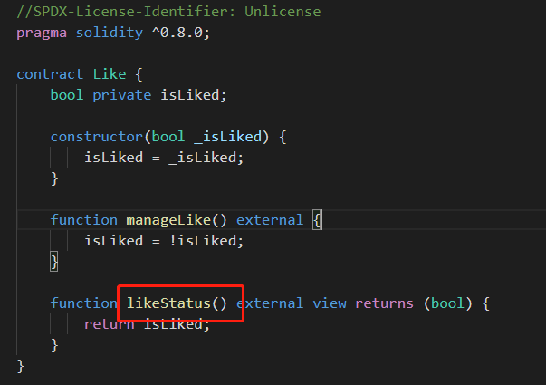
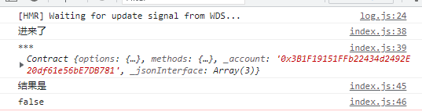
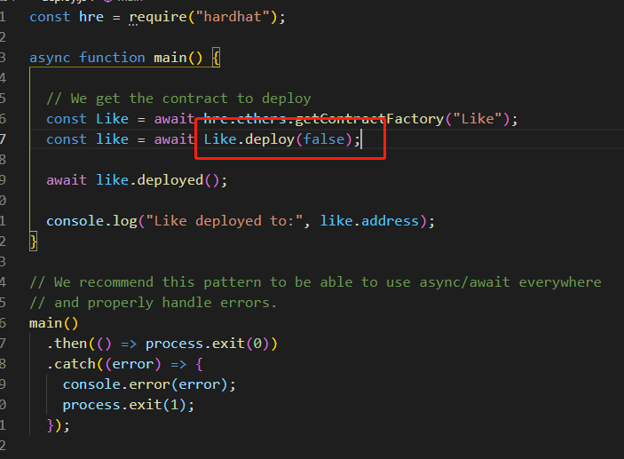

# Ale-ethereum-contract-blind-box

## 1. Contract 部分

> 参考：https://computecoin-network.gitbook.io/computecoin/for-developers/smart-contract-developers/hardhat

### 1. 初始化

> 找一个空的文件夹，作为contract目录

初始化 npm

`npm init`

安装 hardhat 包：

`npm install --save-dev hardhat`

创建 hardhat project

`npx hardhat`



回车选择第一个 Create a sample project

得到四个文件：



### 2. 建contract

在 hardhat.config.js 文件下：

```javascript
module.exports = {
  defaultNetwork: "huygens",
  networks: {
    hardhat: {
    },
    huygens: {
      url: "https://huygens.ccn.org:8545",
      accounts: [privateKey1, privateKey2, ...]
    }
  },
  solidity: {
    version: "0.5.15",
    settings: {
      optimizer: {
        enabled: true,
        runs: 200
      }
    }
  },
  paths: {
    sources: "./contracts",
    tests: "./test",
    cache: "./cache",
    artifacts: "./artifacts"
  },
  mocha: {
    timeout: 40000
  }
}
```

其中 huygens 改成自己的 url 和 account，我改成这样：

```javascript
huygens: {
  url: "http://13.212.177.203:8765",
  accounts: [
    '20EF6DD150025D13A74A25E450467F4D517978CC0FFA6E8EDA0900E3281DCA2E'
  ]
}
```

url 和 Tutorial 视频里面的 .env 文件里面一致


account 和 https://www.youtube.com/watch?v=FfQWVQy5kzg&t=4s 3 : 50开始讲的一样方法生成

### 3. complie contract

`npx hardhat compile`

产生abi文件。==很重要！！！！==

地址：artifacts/contracts/Greeter.sol

compile 不同名字的 contract ，对应不同名字的文件夹。

### 4. deploy contract on huygens

修改scripts文件夹里面那个文件名字为：deploy.js

模板：

```javascript
const hre = require("hardhat");

async function main() {
  // We get the contract to deploy
  const Greeter = await hre.ethers.getContractFactory("Greeter");
  const greeter = await Greeter.deploy("Hello, Hardhat!");

  await greeter.deployed();

  console.log("Greeter deployed to:", greeter.address);
}

main()
  .then(() => process.exit(0))
  .catch((error) => {
    console.error(error);
    process.exit(1);
  });
```

解释：Greeter对应文件夹 contracts 下的 Greeter.sol 的 contract

复制控制台打印的刚刚deploy的contract的地址：

格式：0x3B1F19151FFb22434d2492E20df61e56bE7DB781

## 2. front-end 部分

==前端clone下来的时候，在前端的根目录下执行：==

`npm install`

-----------------------------------

> 参考：https://computecoin-network.gitbook.io/computecoin/for-developers/ale-wallet-developers

clone下来这个文件作为前端的模板：

https://github.com/computecoin-network/Huygens_alewallet_101

关注两个文件：

### 1. abi.json

复制刚才说的 complie contract 后产生的 abi json文件，只复制abi那个数组里面的部分，替换当前的 abi.json里面的内容。每次更改contract 重新compile后要把最新的abi更新到前端 abi.json 里面去，因为是前端调用contract函数的映射。

### 2. contract.js

把刚才deploy后contarct的地址也导入前端文件。

比如：



第7行的 provider 和这个一致：



9行值和 contract deploy 后的地址一致。

### 3. 前端交互



调用了一个叫 Like 的 contract 的likestatus函数，对应：



控制台显示：



因为 isLiked 的初始值设置为 false（contract文件的script/deploy.js）



