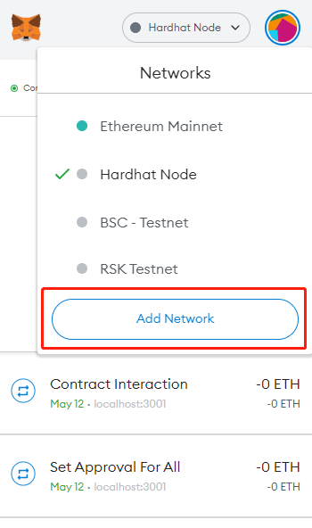
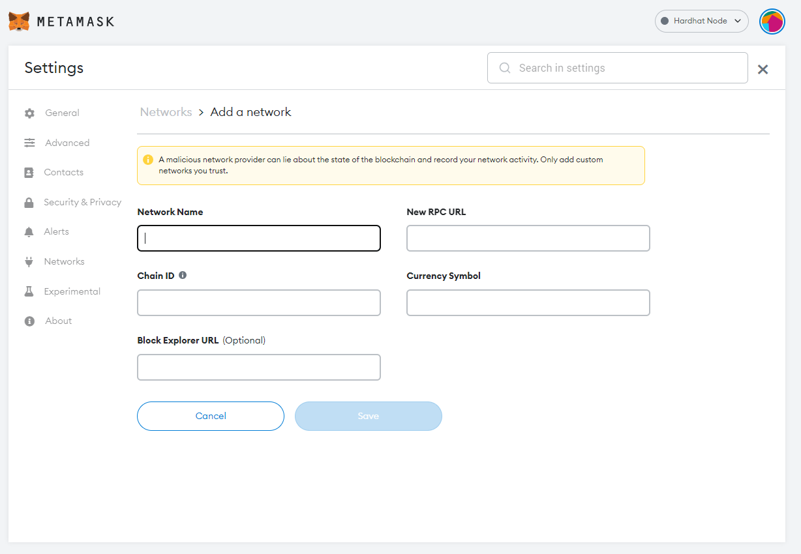
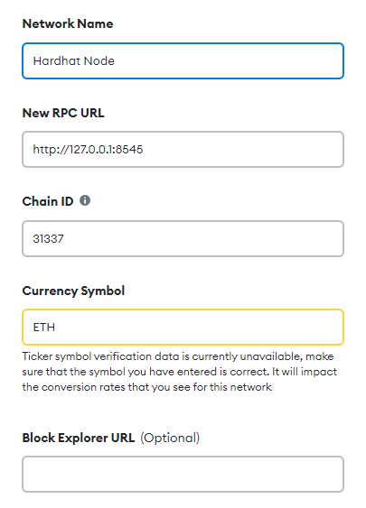

# Course Project Paper
https://drive.google.com/file/d/1Ezah5dL8RTP06JdGcJXfXRgcI2Ul8-Yn/view?usp=sharing

# Run Steps

## 0. Add test Metamask wallet account





The white space inside is the same as the picture below：



Among them, Currency Symbol is forcibly written as ETH

## 1. Install dependencies

Under root directory `Blockchain-MysteryBoxes` ：

```bash
npm install
```

## 2. Deploy contract

```bash
npx hardhat run src/backend/scripts/deploy.js --network localhost
```

## 3. Test (option) 

```bash
npx hardhat test
```

